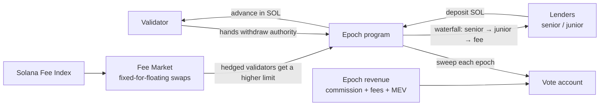
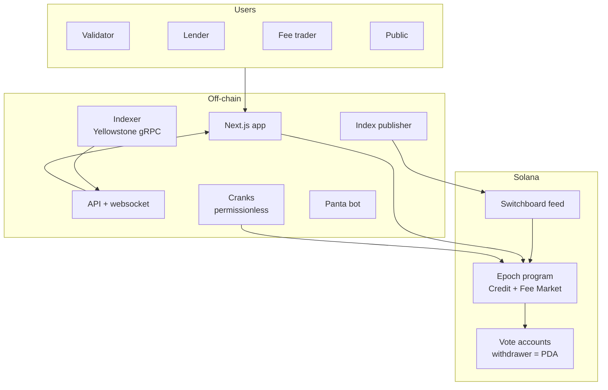

<p align="center">
  
</p>

<p align="center">
  <a href="https://github.com/Sushant6095/epoch-protocol/actions/workflows/ci.yml"></a>
  <a href="LICENSE"></a>
  
  
  
</p>

<p align="center">
  <a href="#how-it-works">How it works</a> ·
  <a href="#architecture">Architecture</a> ·
  <a href="#getting-started">Getting started</a> ·
  <a href="#roadmap">Roadmap</a> ·
  <a href="docs/ARCHITECTURE.md">Docs</a> ·
  <a href="SECURITY.md">Security</a>
</p>

---

**Epoch lets Solana validators borrow against the revenue the network pays them, and lock in the value of that revenue.** Repayment is taken at source: the Epoch program holds the validator's vote-account withdraw authority and sweeps an agreed share of each epoch's revenue to lenders, automatically.

> Web2 analogy: Shopify Capital for validators, plus a fuel hedge for transaction fees.

## Why Epoch

Validators are small businesses with protocol-guaranteed income and no financial tools.

| | |
| --- | --- |
| Validators shut down since 2023 | **2,560 → ~795** ([source](https://www.tradingview.com/news/cointelegraph:d063aebf0094b:0-solana-validator-count-drops-68-as-node-costs-squeeze-small-operators/)) |
| Network revenue, H1 2025 → H1 2026 | **$1.09B → $141M, −87%** ([source](https://www.21shares.com/en-eu/insights/solana-h1-2026-earnings-analysis)) |
| Annual cost to run a validator | **$80k–$128k**, mostly fixed ([source](https://thegoodshell.com/solana-validator-cost/)) |
| Products offering validators cash credit or a revenue hedge | **None** on Solana |

**Why now:** since 8 Sep 2026 ([SIMD-0232](https://github.com/solana-foundation/solana-improvement-documents/blob/main/proposals/0232-custom-commission-collector.md)), block fees can be routed into the vote account alongside inflation commission and Jito MEV commission. A program holding the withdraw authority therefore controls 100% of a validator's revenue, enforced by Solana itself.

## How it works



| Module | What it does |
| --- | --- |
| **Epoch Credit** | Revenue-based advances to validators, repaid at source each epoch. Lenders choose senior (paid first) or junior (first loss) tranches. |
| **Epoch Fee Market** | Per-epoch fixed-for-floating swaps on the Solana Fee Index. Validators lock in income; heavy fee payers cap costs. |
| **Epoch Score** | On-chain credit score from uptime, commission history, age and revenue. Sets advance size and price. |
| **Epoch Terminal** | Public live dashboard of the fee index, validator health and every loan. |

**Credit limit (v1):** `min(a × revenue over last 10 epochs, 2 × bond, cap)` where `a` is 25% unhedged or 40% hedged; 2% flat fee; 50% of each epoch's revenue swept.

## Architecture



All funds live in program-owned accounts. Every off-chain component is read-only or permissionless, except the v1 index publisher, which is bounded and mirrored to Switchboard. Details: [`docs/ARCHITECTURE.md`](docs/ARCHITECTURE.md) · Threats: [`docs/THREAT_MODEL.md`](docs/THREAT_MODEL.md)

## Repository layout

```text
programs/epoch/      Anchor program (Rust)
packages/sdk/        TypeScript client generated from the IDL
services/indexer/    Yellowstone gRPC → Solana Fee Index + revenue → Postgres
services/cranks/     Epoch-boundary jobs: claim, score, sweep, settle, accrue
services/publisher/  Posts the fee index on-chain + Switchboard
services/panta-bot/  Parimutuel markets on the fee index
services/api/        REST + websocket for the Terminal
app/                 Next.js: Terminal, Validator Console, Vault, Fee Market
tests/               Anchor + LiteSVM epoch-boundary tests
docs/                Architecture, threat model, plan, side tracks
```

## Getting started

**Prerequisites:** Rust 1.89 (`rust-toolchain.toml`), Solana CLI, Anchor 1.2 via [AVM](https://www.anchor-lang.com/docs/installation), Node 22+, pnpm.

```bash
git clone https://github.com/Sushant6095/epoch-protocol.git
cd epoch-protocol
cp .env.example .env
pnpm install
anchor keys sync      # generates the program ID
anchor build
anchor test
pnpm dev:app          # http://localhost:3000
```

## Roadmap

- [x] Monorepo scaffold, program skeleton, CI
- [ ] Mechanism proof on testnet: PDA as vote-account withdrawer
- [ ] Credit: onboard → advance → sweep → release on devnet
- [ ] Indexer + Terminal live on mainnet (Solami gRPC)
- [ ] Security review; caps and pause; Squads multisig upgrade authority
- [ ] First real advance on mainnet
- [ ] Fee Market: swaps, settlement, Switchboard feed, Panta markets
- [ ] Colosseum Crypto World's Fair submission (12 Oct 2026)

Full plan with checkpoints: [`docs/PLAN.md`](docs/PLAN.md)

## Side-track integrations

| Track | Integration |
| --- | --- |
| Solami | Indexer and Terminal stream live mainnet data via Solami Yellowstone gRPC |
| RPC Fast | Crank transactions land through RPC Fast; failover data stream |
| Panta | A parimutuel market each epoch on the Solana Fee Index |

## Contributing

See [`CONTRIBUTING.md`](CONTRIBUTING.md). We use Conventional Commits and short-lived branches off `main`.

## Security

Epoch is **pre-alpha and unaudited**. Do not deposit funds you cannot afford to lose. Report vulnerabilities privately as described in [`SECURITY.md`](SECURITY.md).

## Team

| | |
| --- | --- |
| [@Sushant6095](https://github.com/Sushant6095) | Maintainer |
| [@ChahatBiswas](https://github.com/ChahatBiswas) | Maintainer |

## License

[MIT](LICENSE)
