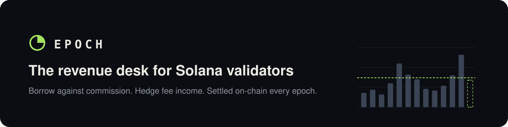
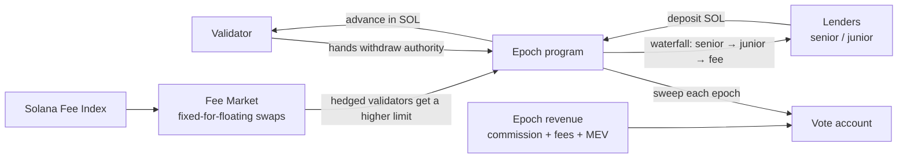
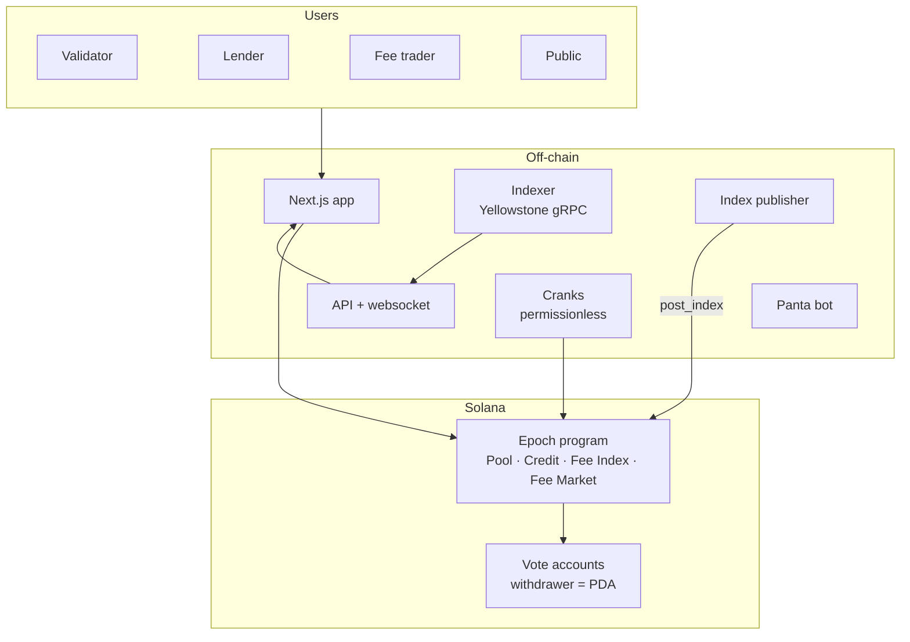

<p align="center">
  
</p>

<p align="center">
  <a href="https://github.com/Sushant6095/epoch-protocol/actions/workflows/ci.yml"></a>
  <a href="LICENSE"></a>
  
  
  
</p>

<p align="center">
  <a href="#how-it-works">How it works</a> ·
  <a href="#architecture">Architecture</a> ·
  <a href="#getting-started">Getting started</a> ·
  <a href="#roadmap">Roadmap</a> ·
  <a href="docs/ARCHITECTURE.md">Docs</a> ·
  <a href="SECURITY.md">Security</a>
</p>

---

**Epoch lets Solana validators borrow against the revenue the network pays them, and lock in the value of that revenue.** Repayment is taken at source: the Epoch program holds the validator's vote-account withdraw authority and sweeps an agreed share of each epoch's revenue to lenders, automatically.

> Web2 analogy: Shopify Capital for validators, plus a fuel hedge for transaction fees.

## Why Epoch

Validators are small businesses with protocol-guaranteed income and no financial tools.

| | |
| --- | --- |
| Validators shut down since 2023 | **2,560 → ~795** ([source](https://www.tradingview.com/news/cointelegraph:d063aebf0094b:0-solana-validator-count-drops-68-as-node-costs-squeeze-small-operators/)) |
| Network revenue, H1 2025 → H1 2026 | **$1.09B → $141M, −87%** ([source](https://www.21shares.com/en-eu/insights/solana-h1-2026-earnings-analysis)) |
| Annual cost to run a validator | **$80k–$128k**, mostly fixed ([source](https://thegoodshell.com/solana-validator-cost/)) |
| Products offering validators cash credit or a revenue hedge | **None** on Solana |

**Why now:** since 8 Sep 2026 ([SIMD-0232](https://github.com/solana-foundation/solana-improvement-documents/blob/main/proposals/0232-custom-commission-collector.md)), block fees can be routed into the vote account alongside inflation commission and Jito MEV commission. A program holding the withdraw authority therefore controls 100% of a validator's revenue, enforced by Solana itself.

## How it works



| Module | What it does |
| --- | --- |
| **Epoch Credit** | Revenue-based advances to validators, repaid at source each epoch. Lenders choose senior (paid first) or junior (first loss) tranches. |
| **Epoch Fee Market** | Per-epoch fixed-for-floating swaps on the Solana Fee Index. Validators lock in income; heavy fee payers cap costs. |
| **Epoch Score** | On-chain credit score from uptime, commission history, age and revenue. Sets advance size and price. |
| **Epoch Terminal** | Public live dashboard of the fee index, validator health and every loan. |

**Credit limit (v1):** `min(a × revenue over last 10 epochs, 2 × bond, cap)` where `a` is 25% unhedged or 40% hedged; 2% flat fee; 50% of each epoch's revenue goes to repayment.

## Architecture



All funds live in program-owned accounts. Every off-chain component is read-only or permissionless, except the v1 Fee Index publisher, whose values are bounded per epoch, held for a dispute window and can be vetoed before they are final. Details: [`docs/ARCHITECTURE.md`](docs/ARCHITECTURE.md) · Diagrams: [`docs/diagrams/`](docs/diagrams/) · Threats: [`docs/THREAT_MODEL.md`](docs/THREAT_MODEL.md)

## Repository layout

```text
programs/epoch/               Anchor program (Rust)
packages/
  epoch-sdk/                  TypeScript client generated from the IDL
  indexer_app/                Yellowstone gRPC → Solana Fee Index + revenue → Postgres
  cranks_app/                 Epoch-boundary jobs: claim, score, sweep, settle, accrue
  publisher_app/              Posts the Solana Fee Index on-chain (self-published oracle)
  panta_bot_app/              Creates real-money (USDC) Panta markets on the fee index
  api_app/                    REST API for the Terminal
  common/ logger/ exceptions/ config-sdk/ common_http_server/ pg_models/ solana/
                              Shared libraries every app is built from
app/                          Next.js: Terminal, Validator Console, Vault, Fee Market
deployments/  pm2.config.js   Containers and single-box process config
tests/                        Anchor + LiteSVM epoch-boundary tests
docs/                         Architecture, threat model, plan, ADRs
```

## Getting started

**Prerequisites:** Rust 1.89 (`rust-toolchain.toml`), Solana CLI, Anchor 1.2 via [AVM](https://www.anchor-lang.com/docs/installation), Node 22+, pnpm.

```bash
git clone https://github.com/Sushant6095/epoch-protocol.git
cd epoch-protocol
cp .env.example .env
pnpm install
pnpm build            # every TypeScript package, in dependency order
pnpm db:up && pnpm db:migrate
pnpm dev:api          # http://localhost:4000/health
pnpm dev:app          # http://localhost:3000

anchor keys sync      # generates the program ID
anchor build
anchor test
```

Before a PR: `pnpm lint && pnpm test && pnpm ccd`. Conventions: [`docs/REPO_STRUCTURE.md`](docs/REPO_STRUCTURE.md).

## Roadmap

- [x] Monorepo scaffold, program skeleton, CI
- [x] Program phases 1–4: pool, credit, Fee Index, fee swaps (29 instructions)
- [x] Revenue tokens on Meteora: register, buyback at source on DBC and DAMM v2, redeem, treasury fee claims to lenders (11 more instructions, 82 unit tests; end to end on a local validator running Meteora's mainnet programs)
- [x] Side tracks: Live (Solami), Predict with real USDC (Panta), Launch (Meteora): backend, program and pages
- [ ] Mechanism proof on testnet: PDA as vote-account withdrawer
- [ ] Credit: onboard → advance → sweep → release on devnet
- [ ] Indexer + Terminal live on mainnet (Solami gRPC)
- [ ] Security review; caps and pause; Squads multisig upgrade authority
- [ ] First real advance on mainnet
- [ ] Fee Market live: first swap epoch settled, Panta markets
- [ ] Colosseum Crypto World's Fair submission (12 Oct 2026)

Full plan with checkpoints: [`docs/PLAN.md`](docs/PLAN.md) · Implementation plan and feature specs: [`docs/IMPLEMENTATION_PLAN.md`](docs/IMPLEMENTATION_PLAN.md) · Repo guide: [`docs/REPO_STRUCTURE.md`](docs/REPO_STRUCTURE.md) · Decisions: [`docs/adr/`](docs/adr/)

## Side-track integrations

| Track | Integration | Page |
| --- | --- | --- |
| Meteora | Validators sell a fixed share of their revenue as a token launched on a DBC curve (Epoch is the partner); every epoch the program buys it back on the curve or its DAMM v2 pool and burns it; Epoch's partner and LP fees are claimed on-chain into the lending pool | Launch |
| Panta | Real-money (USDC, mainnet) markets each epoch on the Solana Fee Index, created by our bot and traded from the Predict page; every trade attributed to Epoch | Predict |
| Solami | The Fee Index computed live from mainnet through Solami's Yellowstone gRPC and RPC; the API's slot ticker and program events over Solami gRPC; every mainnet transaction we sign through Beam; a live usage report (`GET /v1/live/solami`) | Live |
| RPC Fast | Crank transactions land through RPC Fast; failover data stream | — |

Page contracts for the frontend: [`docs/pages/`](docs/pages/README.md) · What is left to go live with real money:
[`docs/GO_LIVE_SIDE_TRACKS.md`](docs/GO_LIVE_SIDE_TRACKS.md) · Track rules: [`docs/SIDE_TRACKS.md`](docs/SIDE_TRACKS.md)

### Solami: the Fee Index, live from mainnet

The Solana Fee Index is computed live from mainnet blocks streamed through [Solami](https://solami.dev)'s Yellowstone
gRPC: every non-vote transaction's priority fee (legacy and v0 `SetComputeUnitPrice`, and the inline fee of SIMD-0385
v1 transactions), each slot's median with leader-paid transactions left out, and the stake-weighted median across
leaders, updated every 2 seconds and settled into `epoch_index` when the epoch ends. Solami RPC fills gaps and snapshots
the leader schedule and stakes; the API's own Solami stream drives the slot ticker and, on mainnet, the program's
events; Solami Beam lands every transaction we sign on mainnet (`post_index`, quotes, every crank send). The Terminal's
Live page shows it slot by slot (`GET /v1/live/*`, WS `slots` and `index:live`), and `GET /v1/live/solami` shows what
each component uses of Solami: gRPC bytes and lag, RPC calls with p50/p95, Beam landings and tips.

```bash
# .env: SOLAMI_TOKEN=<key>  SOLAMI_RPC_URL=https://rpc.solami.dev/sol?api_key=<key>  DATABASE_URL=…
pnpm install && pnpm build && pnpm db:migrate
pnpm solami:check                                  # read-only check of your key: RPC, gRPC, firehose cost, Beam
node packages/indexer_app/dist/index.js            # SLOT_SOURCE=auto: gRPC firehose, or hybrid on a plan stream
node packages/api_app/dist/index.js                # GET /v1/live/summary, GET /v1/live/solami
pnpm demo:solami                                   # the stream in a terminal, for a 2–3 minute demo (works without a key)
```

Get a key at <https://solami.dev/signup?ref=st-earn-sep-26> (gRPC: the Pro plan, gRPC PAYG or a $10/day stream). Setup, every variable, the methodology,
bandwidth costs and the fallback modes: [`packages/indexer_app/README.md`](packages/indexer_app/README.md). Page
contract for the frontend: [`docs/pages/live.md`](docs/pages/live.md).

## Contributing

See [`CONTRIBUTING.md`](CONTRIBUTING.md). We use Conventional Commits and short-lived branches off `main`.

## Security

Epoch is **pre-alpha and unaudited**. Do not deposit funds you cannot afford to lose. Report vulnerabilities privately as described in [`SECURITY.md`](SECURITY.md).

## Team

| | |
| --- | --- |
| [@Sushant6095](https://github.com/Sushant6095) | Maintainer |
| [@ChahatBiswas](https://github.com/ChahatBiswas) | Maintainer |

## License

[MIT](LICENSE)
