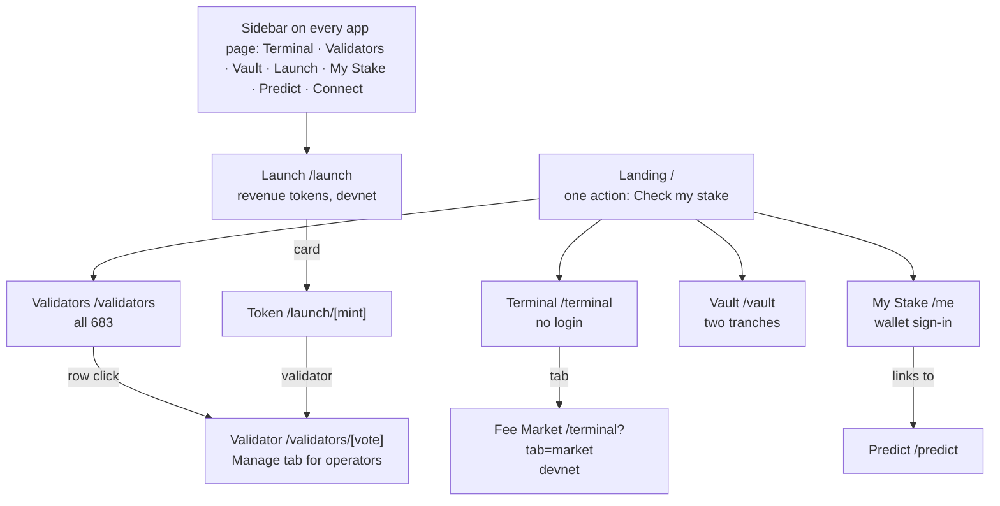

# 02 · Sitemap, routes and folder layout

## Routes (Next.js App Router, `app/src/app/`)

| Route | Page | Access | Spec |
| --- | --- | --- | --- |
| `/` | Landing | Public | `pages/landing.md` |
| `/terminal` | Terminal — the validator economy on one screen | Public | `pages/terminal.md` |
| `/terminal?tab=market` | Fee Market — a Terminal tab: fixed-rate swaps on the Fee Index (devnet) | Public to read; devnet wallet to trade | `pages/fee-market.md` |
| `/validators` | Validators explorer (all 683) | Public | `pages/validators.md` |
| `/validators/[vote]` | Validator profile; Manage tab for its operator | Public; Manage = operator wallet | `pages/validator.md` |
| `/me` | My Stake (signed out: sign-in split screen) | Wallet sign-in or read-only address | `pages/my-stake.md`, `pages/sign-in.md` |
| `/predict` | Predict, its own page (30 Sep: to match its Stocktwits screen); `/me#predict` redirects here | Signed in, 18+ and region check before the first call | `pages/predict.md` |
| `/vault` | Vault: senior and junior tranches | Public to read; wallet to deposit | `pages/vault.md` |
| `/launch` | Launch: validator revenue tokens on Meteora (devnet) | Public | `pages/launch.md` |
| `/launch/[mint]` | One revenue token: what backs it, its curve and buybacks, Trade card | Public to read; devnet wallet, 18+ and region gate to trade | `pages/launch.md` |
| `/me?address=<wallet>` | Read-only My Stake for any address | Public | `pages/my-stake.md` |

Tabs keep their own state in the URL (nuqs): `/validators/[vote]?tab=revenue`, `/terminal?table=loans`,
`/terminal?tab=market&epoch=1045`, `/launch?tab=past`, `/validators?tab=healthy&chips=zero-fee,hide-top18&sort=apy`.
`/me#predict` redirects to `/predict`.

The **Fee Market** (a Terminal tab) and **Launch** (validator revenue tokens on a Meteora bonding curve, ADR 0006,
the Meteora side track) are in scope since 1 Oct (decisions 8 and 9). Build them after the Gate 2 pages, in the slots
in `09-BUILD-ORDER.md`.



## App shell (every page)

- **Header, 64 px, sticky.** Epoch-ring logo (the ring fills with epoch progress) · nav: Terminal,
  Validators, Vault, Launch, My Stake, Predict · search (`/` or ⌘K opens cmdk; accepts a validator name, vote
  account, wallet or signature and routes to the right page) · epoch pill (live dot, epoch number, %,
  countdown to next rewards) · SOL price · Connect button or account chip (menu: address copy, switch
  wallet, read-only address, sign out).
- **Footer strip, 44 px.** Slot, TPS, data sources with their time, network badge (mainnet or devnet),
  lightweight-charts attribution link, "Unaudited pre-alpha · not financial advice" on Vault, Manage, Predict, Fee
  Market and Launch surfaces (SH13).
- **Phones.** Header collapses to logo + epoch pill + menu button; nav moves into a vaul sheet; the
  right-docked action panels become a bottom sheet with the primary button pinned.

## Links that carry people deeper

| From | Element | Goes to |
| --- | --- | --- |
| Landing | Check my stake (hero and final band), audience cards | My Stake |
| Landing | Open the Terminal · Open the Vault · See a validator's console | Terminal · Vault · a validator profile |
| Landing | Five explorer tiles | Solana Explorer, Orb, Solscan, Solana Beach, validators.app (new tab) |
| Terminal | Loan book and Top validators rows · All 683 validators | Validator profile · Validators |
| Terminal | Open the Vault | Vault |
| Terminal | Fee Market tab · Recent swaps validator name | Fee Market · Validator profile |
| Launch | Launch card · validator name | Token page · Validator profile |
| Token page | View on ▾ · buyback rows | Solana Explorer `?cluster=devnet` (new tab) |
| Validators | Name or View on a row · Compare side by side | Validator profile |
| Validator profile | Stake with this validator · View on | My Stake · six explorers (new tab) |
| My Stake | Stake more, Browse all 683 · a stake-account row | Validators · Validator profile |
| My Stake | See healthier options · Earn more in the Vault | the section below · Vault |
| Vault | Loan book on the Terminal · How a validator borrows · See it in My Stake | Terminal · Validator profile · My Stake |

## Folder layout inside `app/`

```text
app/
  CLAUDE.md  .mcp.json  .claude/  .impeccable/     ← this kit (agent law, MCP servers, guards)
  components.json                                  ← shadcn config copied from handover/design/ (never run shadcn init)
  handover/                                        ← this kit (specs, contracts, fixtures, design sources)
  design/screens/impl/  design/verdicts/           ← screenshots of OUR app and design-cop verdicts
  scripts/setup-frontend.sh  scripts/install-skills.sh  scripts/ui/screenshot.mjs
  src/
    app/                     routes: layout.tsx, page.tsx, terminal/, validators/, validators/[vote]/, me/, predict/, vault/,
                             launch/, launch/[mint]/
    components/
      ui/                    shadcn primitives (generated, then re-skinned)
      vendor/_raw/           raw registry pulls, never imported
      shell/                 Header, EpochPill, EpochRing, Footer, NetworkBadge, SearchCommand
      charts/                StakeFlowChart, FeeIndexChart, SharePriceChart, LossWaterfall, Sparkline
      validators/            ValidatorsTable, ScoreRing, HealthBadge, DependencyBar, CompareTray
      validator/             ValidatorHeader, Gauges, StakeMovesTable, BorrowConsole
      vault/                 TrancheCard, DepositPanel, StressTestSlider, AdvancesTable
      predict/               PredictMarketCard, PredictTicket, MyCalls, Leaderboard
      market/                SwapTicket, QuotesTable, FeeIndexForwardChart, PayoffLine, SwapsTables
      launch/                LaunchCard, LaunchHero, CurveCard, BacksPairs, BuybackFeed, TradeCard
      wallet/                WalletSignIn, TxPreview, WalletProvider
      landing/               Hero, SlotRuler, HowItWorks, StatBand, VerifyTiles
    design/motion.ts         motion tokens
    fixtures/                copies of handover/fixtures/*.json
    lib/
      data/                  types.ts (from handover/contracts) + one hook per resource
      gsap.ts  anime.ts      animation wrappers
      utils.ts               re-exports cn for registry components that import @/lib/utils
      explorers.ts           explorer link builders
      format.ts              SOL, %, compact numbers, "—" for missing
      health.ts              the health rules (one module)
    styles/tokens.css  styles/globals.css
```
