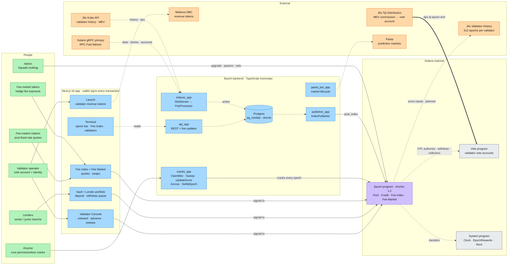
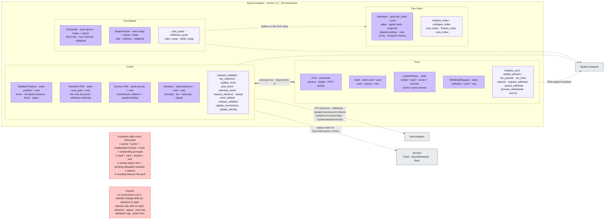
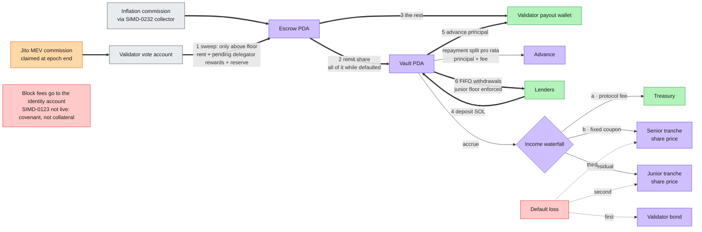
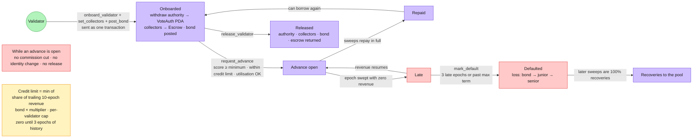

# Epoch system design — Excalidraw prompt pack

Everything needed to draw Epoch's system design in Excalidraw: a detailed prompt for an AI diagram tool, and the same five frames as Mermaid code that Excalidraw converts into editable shapes. The Mermaid blocks were rendered with mermaid-cli 11 to check they are valid.

## 1. How to use it

1. **Fastest, fully editable:** open excalidraw.com → the shapes/tools icon (triangle, circle, square) → **Mermaid to Excalidraw** → paste one Mermaid block from section 3 → Insert. Repeat for all five frames, place them in a grid, then do the polish in section 4.
2. **AI route:** paste the master prompt (section 2) into Claude or ChatGPT and ask for "Mermaid flowchart code for each frame" (or Excalidraw JSON), then import as in step 1.
3. **Excalidraw's built-in AI (Text to diagram):** it works best with short input, so paste one FRAME section of the master prompt at a time.

## 2. Master prompt

```text
You are a senior systems architect and an expert Excalidraw illustrator. Draw the complete system design of "Epoch — the revenue desk for Solana validators" on ONE Excalidraw canvas made of FIVE titled frames. Use Excalidraw's hand-drawn style on a white background, generous spacing, straight or right-angled arrows that never cross a box, and label every box and arrow exactly as written below. Box title on the first line (bold), detail on a smaller second line.

CONTEXT (do not draw this paragraph):
Solana validators earn commission every epoch (about 2 days). Epoch lets a validator borrow SOL today against that future commission. The validator hands its vote account's withdraw authority to an Epoch program address, points its commission collectors (SIMD-0232) at an Epoch escrow, and posts a bond. Lenders fund advances through a senior tranche (fixed coupon, paid first) and a junior tranche (first loss, keeps the residual). Every epoch a permissionless "sweep" pulls revenue out of the vote account and repays the advance at source. Epoch also publishes the Solana Fee Index (stake-weighted median priority fee per epoch) and runs fee swaps that settle against it. Validators can launch revenue tokens on Meteora's Dynamic Bonding Curve.

LEGEND (draw it as a box in the top-right corner of the canvas):
Colours:
- Green #b2f2bb = people and wallets
- Blue #a5d8ff = Epoch off-chain services
- Violet #d0bfff = Epoch on-chain program and its accounts (PDAs)
- Grey #e9ecef = Solana native programs and sysvars
- Orange #ffd8a8 = external protocols and data providers
- Red #ffc9c9 = invariants, guards and risks (sticky notes)
- Yellow #fff3bf = formulas and notes
Arrows:
- Thick solid = SOL moves
- Thin solid = user action or signed transaction
- Dashed = data read or stream
- Dotted = CPI (cross-program invocation)
- Numbered circles on arrows = order of steps

CANVAS TITLE (top-left): "Epoch — system design", subtitle "Solana validator credit · senior/junior vault · Fee Index · fee swaps".
LAYOUT: Frame 1 across the full width on top; Frames 2 and 3 side by side in the middle row; Frames 4 and 5 side by side in the bottom row.
FOOTER (small text): "Program: Anchor 1.2 · 29 instructions · 41 unit tests · github.com/Sushant6095/epoch-protocol"

FRAME 1 — "System context" (five vertical swimlanes, left to right)
Lane "People" (green boxes):
- Validator operator — "vote account + identity"
- Lenders — "senior / junior tranche"
- Fee-market makers — "post fixed-rate quotes"
- Fee-market takers — "hedge fee exposure"
- Anyone — "runs permissionless cranks"
- Admin — "Squads multisig: upgrade key, params, index veto"
Lane "App" (one large blue rounded box titled "Next.js 16 app · wallet signs every transaction · UI holds no keys") containing small page tiles: Terminal · Validator explorer · Validator profile · Validator Console · Vault · Lender portfolio · Fee Index · Fee Market · Launch
Lane "Epoch backend" (blue, titled "TypeScript monorepo"):
- api_app — "REST + live updates to the app"
- indexer_app — "SlotStream → FeeProcessor (stake-weighted median)"
- Postgres (cylinder) — "pg_models · drizzle"
- cranks_app — "ClaimMev · Sweep · UpdateScore · Accrue · SettleEpoch"
- publisher_app — "IndexPublisher: posts the Fee Index"
- panta_bot_app — "opens and resolves Panta markets"
- a thin strip at the bottom of the lane: "shared libs: solana (ConnectionManager · GrpcStream · TransactionSender · EpochClock) · epoch-sdk · config-sdk · logger"
Lane "Solana mainnet":
- Large violet box "Epoch program · Anchor 1.2 · 29 instructions" with four inner tiles: Pool · Credit · Fee Index · Fee Market
- Grey "Vote program" with three small vote-account icons labelled "validator vote accounts"
- Grey "System program" and grey "Sysvars: Clock · EpochRewards · Rent"
Lane "External" (orange):
- "Jito Tip Distribution — MEV commission claimed into vote accounts"
- "Jito Validator History — 512 epochs per validator (score inputs, planned)"
- "Jito Kobe API — validator history and MEV data"
- "Meteora Dynamic Bonding Curve — validator revenue tokens"
- "Panta — prediction markets on epoch outcomes"
- "Solami gRPC (primary) · RPC Fast (failover)"
Arrows:
- each person → the app page they use (thin, "connect wallet · sign")
- app pages → Epoch program (thin, "signed transactions")
- app ⇢ api_app (dashed, "reads"); api_app ⇢ Postgres (dashed)
- Solami gRPC / RPC Fast ⇢ indexer_app (dashed, "slots · blocks · accounts"); Jito Kobe API ⇢ indexer_app (dashed, "history · tips"); indexer_app ⇢ Postgres (dashed, "writes")
- Anyone → cranks_app (thin); cranks_app → Epoch program (thin, "permissionless cranks every epoch")
- Postgres ⇢ publisher_app (dashed); publisher_app → Epoch program (thin, "post_index")
- Epoch program ⋯> Vote program (dotted, "CPI: authorize · withdraw · set collectors")
- Jito Tip Distribution ⟹ vote accounts (thick, "MEV commission at epoch end")
- Epoch program ⇢ Jito Validator History (dashed, "reads score inputs · planned")
- Launch page ⇢ Meteora DBC (dashed); panta_bot_app ⇢ Panta (dashed)
- Admin → Epoch program (thin, "upgrade · params · veto")

FRAME 2 — "Epoch program map" (one large violet container, four module columns side by side)
Each column has violet account cards (name · PDA seed in brackets · one-line purpose) and a pale-violet instruction strip in monospace.
Pool:
- Pool [pool] — "params · ledger · FIFO withdrawal queue"
- Vault [vault, pool] — "holds cash + bonds + rent"
- LenderShares [lender, pool, owner, tranche] — "senior / junior shares"
- WithdrawRequest [withdraw, pool, seq]
- instructions: initialize_pool · update_params · set_paused · set_roles · deposit · request_withdraw · cancel_withdraw · process_withdrawal · accrue
Credit:
- ValidatorPosition [position, vote] — "score · 10-epoch revenue · bond · status"
- VoteAuth PDA [vote_auth, vote] — "the vote account's withdraw authority"
- Escrow PDA [escrow, vote] — "commission collector + sweep landing"
- Advance [advance, vote, seq] — "principal · fee · total due · repaid"
- instructions: onboard_validator · set_collectors · update_score · post_bond · withdraw_bond · request_advance · sweep · mark_default · release_validator · update_commission · update_identity
Fee Index:
- FeeIndex [fee_index, pool] — "value · inputs hash · proposal · dispute window · max move · 16-epoch history"
- instructions: initialize_index · configure_index · post_index · finalize_index · veto_index
Fee Market:
- FeeQuote [quote, maker, epoch] — "fixed rate · max notional · collateral"
- SwapPosition [swap, quote, taker] — "side · notional · collateral"
- instructions: post_quote · withdraw_quote · open_swap · settle_swap
Outside the container, on the right (grey): Vote program · System program · Sysvars (Clock · EpochRewards · Rent)
Arrows:
- Credit ⋯> Vote program (dotted, "Authorize · Withdraw · UpdateCommissionCollector · UpdateCommissionBps · UpdateValidatorIdentity")
- Pool, Credit, Fee Market ⋯> System program (dotted, "PDA-signed lamport transfers")
- Credit ⇢ Sysvars (dashed, "sweep waits until EpochRewards distribution ends")
- Fee Market ⇢ Fee Index (dashed, "settles on the final value")
- Credit ⟺ Pool (thick double arrow, "principal out · repayments in")
Red sticky note "Invariants — checked after every instruction":
1. senior assets + junior assets + unallocated income = cash + outstanding principal
2. vault balance = cash + bonds + rent
3. a sweep never takes a vote account below rent + pending delegator rewards + reserve
4. rounding always favours the pool
Red sticky note "Guards": no commission cut or identity change while an advance is open · release only with no open advance · pause switch · pool cap · utilisation cap · junior floor

FRAME 3 — "Where the SOL goes every epoch" (money flow left to right, thick arrows, numbered)
- "Inflation commission — via SIMD-0232 collector" ⟹ Escrow PDA
- "Jito MEV commission — claimed at epoch end" ⟹ Validator vote account
- ① Validator vote account ⟹ Escrow PDA: "sweep: only above the floor = rent + pending delegator rewards + reserve"
- ② Escrow PDA ⟹ Vault PDA: "remit share (all of it while defaulted)"
- ③ Escrow PDA ⟹ Validator payout wallet: "the rest"
- Vault PDA → Advance: "repayment split pro rata between principal and fee"
- ④ Lenders ⟹ Vault PDA: "deposit SOL"
- ⑤ Vault PDA ⟹ Validator payout wallet: "advance principal"
- Vault PDA → diamond "Income waterfall (accrue)": a · protocol fee → Treasury; b · fixed coupon → Senior tranche share price; c · residual → Junior tranche share price
- red dashed "Default loss" → first Validator bond, second Junior tranche, third Senior tranche
- ⑥ Vault PDA ⟹ Lenders: "FIFO withdrawals, junior floor enforced"
- grey note: "Block fees go to the identity account today. SIMD-0123 (block revenue sharing) is not live, so block fees are a covenant, not collateral."

FRAME 4 — "Validator lifecycle" (state machine with rounded states)
- Validator (green circle) → Onboarded via onboard_validator + set_collectors + post_bond ("sent as one transaction: withdraw authority → VoteAuth PDA · collectors → Escrow · bond posted")
- Onboarded → Advance open via request_advance ("score ≥ minimum · within credit limit · pool utilisation OK")
- Advance open → Repaid ("sweeps repay in full") → Onboarded ("can borrow again")
- Advance open → Late ("an epoch swept with zero revenue"); Late → Advance open ("revenue resumes")
- Late → Defaulted via mark_default ("3 late epochs, or advance older than the maximum term"; "loss absorbed: bond → junior → senior")
- Defaulted → "Recoveries to the pool" ("later sweeps remit 100%")
- Onboarded → Released via release_validator ("withdraw authority, collectors, bond and escrow returned")
- red note: "While an advance is open: no commission cut · no identity change · no release"
- yellow note: "Credit limit = min(share of trailing 10-epoch revenue, bond × multiplier, per-validator cap); zero until 3 epochs of history"

FRAME 5 — "Fee Index and fee swaps" (three rows)
Row 1, off-chain data (blue, dashed arrows): Solana blocks "priority fees per slot" ⇢ Solami gRPC · RPC Fast ⇢ indexer_app SlotStream ⇢ FeeProcessor "stake-weighted median per epoch" ⇢ Postgres ⇢ publisher_app
Row 2, on-chain index (violet): publisher_app → Proposal ("post_index: epoch · value · inputs hash") → diamond "Dispute window · N slots" → "finalize_index · anyone" → "FeeIndex value · 16-epoch history". Admin multisig → Proposal (red arrow, "veto_index until final"). Red note: "A proposal is rejected if it moves more than max_move_bps from the last final value."
Row 3, market (violet + green): Maker → FeeQuote ("post_quote: epoch · fixed rate · max notional"; "collateral = notional × max move"). Taker → SwapPosition ("open_swap: pay-fixed or receive-fixed"; "taker collateral"). FeeIndex value ⇢ settle_swap ("anyone · payoff = notional × (index − fixed) ÷ fixed, clipped to ± max loss"). FeeQuote → settle_swap; SwapPosition → settle_swap; settle_swap ⟹ "Taker paid · maker withdraws after expiry (withdraw_quote)". Small note: "trading closes when the quoted epoch starts".

QUALITY BAR: consistent box widths within a lane, 40px gaps, arrows labelled mid-segment, no text smaller than 14px, the legend visible without zooming, and every frame readable on its own in a 1280×720 screenshot.
```

## 3. Mermaid code, one block per frame

### Frame 1 — System context



### Frame 2 — Epoch program map



### Frame 3 — Where the SOL goes every epoch



### Frame 4 — Validator lifecycle



### Frame 5 — Fee Index and fee swaps

```mermaid
flowchart LR
  subgraph DATA["Off-chain data"]
    BLK["Solana blocks<br/>priority fees per slot"] -.-> RPC["Solami gRPC · RPC Fast"]
    RPC -.-> SS["indexer_app · SlotStream"]
    SS -.-> FP["FeeProcessor<br/>stake-weighted median per epoch"]
    FP -.-> PG[("Postgres")]
    PG -.-> PUB["publisher_app"]
  end

  subgraph INDEX["On-chain Fee Index"]
    PROP["Proposal<br/>epoch · value · inputs hash"]
    WIN{"Dispute window<br/>N slots"}
    FIN["finalize_index · anyone"]
    VAL["FeeIndex value<br/>16-epoch history"]
  end

  subgraph MARKET["Fee Market"]
    MK["Maker"] -->|"post_quote<br/>epoch · fixed rate · max notional"| Q["FeeQuote<br/>collateral = notional × max move"]
    TK["Taker"] -->|"open_swap<br/>pay-fixed or receive-fixed"| SW["SwapPosition<br/>taker collateral"]
    SET["settle_swap · anyone<br/>payoff = notional × (index − fixed) ÷ fixed<br/>clipped to ± max loss"]
  end

  PUB -->|"post_index"| PROP
  PROP --> WIN
  WIN --> FIN
  FIN --> VAL
  ADM["Admin multisig"] -->|"veto_index until final"| PROP
  VAL -.->|"final value"| SET
  Q --> SET
  SW --> SET
  SET ==>|"lamports move between quote and swap"| PAYOUT["Taker paid · maker withdraws after expiry"]
  RULE["Rejected if it moves more than max_move_bps<br/>from the last final value<br/>trading closes when the quoted epoch starts"]

  classDef offchain fill:#a5d8ff,stroke:#1971c2,color:#1b1b1b
  classDef onchain fill:#d0bfff,stroke:#6741d9,color:#1b1b1b
  classDef people fill:#b2f2bb,stroke:#2f9e44,color:#1b1b1b
  classDef native fill:#e9ecef,stroke:#495057,color:#1b1b1b
  classDef external fill:#ffd8a8,stroke:#e8590c,color:#1b1b1b
  classDef risk fill:#ffc9c9,stroke:#e03131,color:#1b1b1b
  class SS,FP,PG,PUB offchain
  class PROP,WIN,FIN,VAL,Q,SW,SET onchain
  class MK,TK,ADM,PAYOUT people
  class BLK native
  class RPC external
  class RULE risk
```



## 4. Polish in Excalidraw (about 10 minutes)

- Add the legend box from the master prompt (colours + arrow meanings) in the top-right corner.
- Put numbered circles ①–⑥ on the Frame 3 money arrows; make SOL arrows thick, data arrows dashed, CPI arrows dotted.
- Give each frame a title bar and group it (Cmd/Ctrl + G) so frames move as one piece.
- Straighten long connectors in Frame 1: People on the far left, External on the far right.
- Export PNG at 2× (white background for docs, dark for slides) and SVG for the README.
